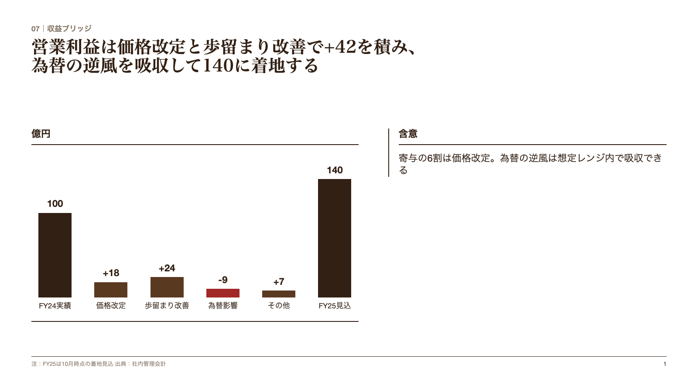
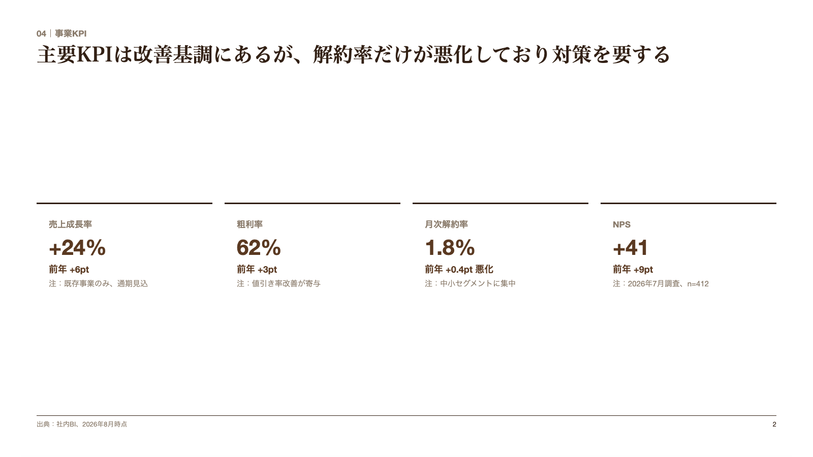
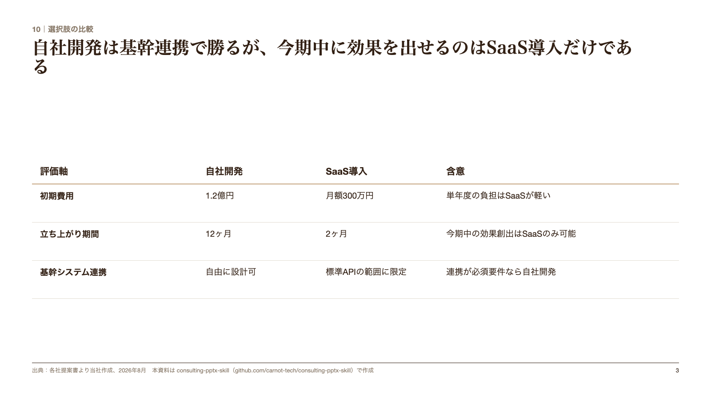

# consulting-pptx-skill

**AIに「まじ」なPowerPointを作らせるためのClaude Codeスキル。**
スライド作成規約（約110項目）＋機械チェック＋**62型のスライド型カタログ**（すべて SlideSpec から編集可能PPTXで書き出せる）＋自由記述HTMLパーツ集＋生成パイプライン（HTMLプレビュー→編集可能PPTX）の一式です。

作り方の本線は**自由記述**（HTMLパーツ集をコピーして1枚ずつ組む）で、SlideSpec パイプラインは「たたき台を秒で出す」「編集可能PPTXで渡す」ときの補助経路です。どちらで作っても、規約 → 機械チェック → 別エージェントのレビュー、の順は同じです。

A Claude Code skill for generating boardroom-quality decks: a 62-archetype slide catalog, every archetype exportable as natively editable PPTX from a JSON SlideSpec, a freeform HTML parts library, a render pipeline (HTML preview → editable PPTX), a slide-design rulebook, and an automated rule checker.

私たちが実際に毎週の提案書・報告書づくりで使っている仕組みの公開版です。解説記事はこちら → [AIにまじなスライド作らせる（note）](https://note.com/jinbaflow/n/nc8372b84e572)

## 本質は `references/slide-rules.md`（約110項目のスライド規約）

このリポジトリでいちばん価値があるのは、実はテンプレでもスクリプトでもなく、**[slide-rules.md](references/slide-rules.md)** というテキストファイルです。実務の資料レビューで受けた指摘を1行ずつ書き溜めた約110項目。「結論はタイトルに書く」「角丸禁止」「塗りのあるボックスに枠線を付けない」「1資料1用語」「前提・定義は左、帰結は右」…。

使い方はシンプルで、**AIに資料を作らせる前に毎回このファイルを読ませ、出力後に `scripts/check_deck.py` で違反を機械検出し、最後に `references/content-review-prompt.md` で作り方を伏せた別エージェントにデッキのファイルを渡して、日本語の言い回し・論理展開・内容の矛盾を拾わせ、指摘を採否表にして採用分だけ直す**だけ。AIはセッションごとに記憶がリセットされるので、口頭で注意しても定着しません。ルールをファイル化して毎回読ませるのが唯一の定着方法です。

そして、良いスライドを作るのは型ではなく**流し込んだ後の調整**です。表を2枚に割る、右カラムを帰結形に書き直す、タイトルの通し読みでストーリーを繋ぎ直す — 型に囚われず考えて直し、そこで受けた指摘をまた slide-rules.md に1行追記する。この蓄積ループが品質の源泉で、型カタログとパイプラインは「たたき台を数十秒で出して、調整の反復回数を稼ぐ」ための道具にすぎません。

自社で使うときは、slide-rules.md に自社の規約・指摘を追記して育ててください。

## 最近追加した規約（抜粋）

実案件のレビューで受けた指摘を抽象化して追記しています。直近の追加分:

- **読み順と配置**（§4.37〜4.48）: 前提・定義・理由は左、具体例・結果・プレイヤーは右。表と図の並び順と向きを揃える。右カラムの論点は左の図の該当行に帯とラベルで対応付ける。倍率の比較は起点と比較先を矢印で示す。順序性のある行には方向を示す軸を添える。問題ページの後には「〜で越えられる」解消ページを対で置く。出典・注釈は左下の定位置。
- **AIぽさの3要因**（§7冒頭）: フローティングボックス／ブレットを使わない冗長な説明／主語・述語を抜いた異様な短縮。出力前にこの3つだけは必ず目視する。
- **チャートの基本形**（§5.12）: テーブル／左に前提・右に意味合い／左右対比／左に分析・右に解説の4つを先に当て、当てはまらないときだけ応用形（矢羽など）。チャートにクリエイティブさは要らない。
- **タイトル**（§2.1, §2.4, §2.10〜11）: 1行が基本、長ければ2行可（文字を縮小して1行に詰めない）。ページの中身の個数（「3つの理由」）をタイトルに入れない。チャートのページには So what（意味合い）を必ず載せ、事実の図だけで終えない。事実より強い言い切りをしない。
- **表**（§6）: 主張に効かない列は置かない。列見出しは中身を指す具体名詞（「事実」のような抽象語は不可）。列を定義したらセルの粒度を揃え、別カテゴリを混ぜない。
- **フレッシュアイ・レビュー**（§8）: 文脈を共有しない別エージェントにデッキのファイルを渡し、日本語・論理・破綻を指摘させ、採否表を作ってから直す。`check_deck.py` はタイトル80字超のみ FAIL、40字超は「2行想定」の WARN。

## 62型のスライド型カタログ

入口は **[assets/SlideCatalog_16x9.pdf](assets/SlideCatalog_16x9.pdf)**（70ページ）です。A 枠組み／B 数字で証明／C 比較・評価／D 構造で通す／E 進め方・計画／F 提示・締め の6章に62型を並べ、P.2 の索引と各ページ右下の「PPTX」「HTML」がその型を出せる経路を示します。同じ70枚を PPTX にした **[assets/SuperTemplate_62type.pptx](assets/SuperTemplate_62type.pptx)** も置いています。**70枚すべてがネイティブ図形（表・図形・チャート）で、PowerPoint でそのまま編集できます**。スライド番号＝カタログのページ番号。

「62型」は作れる見せ方の上限ではありません。実際のデッキでは、型を組み合わせたり崩したりして規約の範囲で自由に組むので、見せ方のパターンはこれより多くなります。型カタログは「レイアウトの発想帳」として使い、合わなければ捨ててください。

内訳は、もともとの SlideSpec 36型のうち表紙を除く35型と、自由記述パーツ集の27パーツを SlideSpec の型として実装したもの（`pipeline/scripts/archetypes/`、型ID一覧は下）。`pipeline/slide-spec/super_template.json` には63型（36＋27）の完成 SlideSpec が入っており、どの型も `npm run export` で編集可能PPTXになります。もともとの36型は [docs/catalog/](docs/catalog/) に1枚ずつ画像でも置いています（既定の warm スキンで再生成済み）（テンプレ再描画: `TEMPLATE_MODE=1 npm run render -- slide-spec/super_template.json generated/super_template.html`。型名だけのタイトルは通常の最短字数チェックに引っかかるため、この環境変数で検証を外します）。

カタログPDFと62型PPTXの再生成は `python3 scripts/build_slide_catalog.py`（要: `pipeline/` で `npm run setup` 済み、`pip3 install python-pptx`、LibreOffice）。配色は自由記述パーツ集・SlideSpec 生成デッキ・カタログのすべてで同じ暖色系（warm）が既定です。ネイビー系にするときは SlideSpec ルートに `"skin": "cool"`、個別の色は `palette` で上書きできます。

型ID・使いどころ・SlideSpec のフィールド仕様（パーツ由来27型の `parts` の中身を含む）は **[references/archetype-catalog.md](references/archetype-catalog.md)** に1本化しています。ここには重複して載せません。

## 作り方は2経路、型カタログは1本

| 経路 | 実体 | 出せるもの | 使うとき |
| --- | --- | --- | --- |
| **自由記述（本線）** | `templates/freeform_parts_16x9.html`（27パーツ） | HTMLデッキ → PDF | 納品物。主張に合わせて1枚ずつ組む |
| **SlideSpec パイプライン** | `pipeline/slide-spec/super_template.json`（63型＝36＋パーツ由来27） | **編集可能なPPTX** | たたき台を秒で出す・PowerPointで渡す・カタログの62型どれでも |

どちらの型も **タイトル欄は型名だけ**で、見本の主張文は置いていません。見本文があると文型がそのまま真似され、主張ではなくテンプレを写した資料になるからです（slide-rules §2.8）。タイトルは必ずストーリーラインから起こして差し替えます。

**色と書体も両経路で同じ既定**です（暖色系 warm スキン: 生成りの地・濃茶の文字・茶のアクセント、見出し明朝・本文ゴシック）。トークンの正本は `pipeline/html-css/consulting-slide-system.css` の `:root`、自由記述テンプレの `<style>` 冒頭 `:root` はその写しです。ネイビー系にするときは SlideSpec ルートに `"skin": "cool"`（テンプレ側はコメント同梱の値に差し替え）。

プレースホルダーの書き方は両経路で統一しています: 本文 `Text 1`、項目名 `ラベル 1`、見出し `タイトル 1`、数値 `00`、年 `YYYY年`、指標行 `指標名、単位、YYYY〜YYYY年`、出典 `出典：Source 1`。`check_deck.py` はこれらが納品デッキに残っていたら **FAIL**、タイトルの文型が6割以上同じなら **WARN** にします（テンプレ集そのものを検査するときだけ `--template`）。

パーツ集の主なもの: 主張パネル＋図／打ち手の効果表／状態ヒートマップ／充足度評価表（ハーベイボール）／割合のドットマトリクス／進捗バブル行列／分布の順位棒／注記つき散布図／柱＋土台／対向シェブロン／外部動向の根拠グリッド／比例円の対比／増減の縦棒／シナリオ線＋成長率チップ／調査の土台／課題と打ち手の2カラム／セパレーター（章扉＝アジェンダ再掲・現在地を強調）。

## たたき台を秒で出す仕組み（SlideSpec）

核心は「**AIにレイアウトを描かせない**」こと。63型それぞれのレイアウト（タイトル位置・余白・フォントサイズ・作図ルール）は実測値としてレンダラーに焼き込んであり、AIが書くのは中身（主張・数値・ラベル）だけです。

このJSON（SlideSpec）を書くと——

```json
{
  "template": "waterfall",
  "kicker": "07｜収益ブリッジ",
  "title": "営業利益は価格改定と歩留まり改善で+42を積み、為替の逆風を吸収して140に着地する",
  "chart": {
    "unit": "億円",
    "series": [
      { "label": "FY24実績", "value": 100, "kind": "base" },
      { "label": "価格改定", "value": 18, "kind": "up" },
      { "label": "歩留まり改善", "value": 24, "kind": "up" },
      { "label": "為替影響", "value": -9, "kind": "down" },
      { "label": "その他", "value": 7, "kind": "up" },
      { "label": "FY25見込", "value": 140, "kind": "total" }
    ]
  },
  "sections": [ { "title": "含意", "copy": "寄与の6割は価格改定。為替の逆風は想定レンジ内で吸収できる" } ],
  "note": "注：FY25は10月時点の着地見込",
  "source": "出典：社内管理会計"
}
```

——この1枚が出てきます。



ほかの例（`pipeline/slide-spec/example_deck.json` に3枚分を同梱）:

| kpi_dashboard | comparison_table |
| --- | --- |
|  |  |

## セットアップ

```bash
# Claude Codeのスキルフォルダにcloneするだけ
git clone https://github.com/carnot-tech/consulting-pptx-skill.git ~/.claude/skills/consulting-pptx-skill

# パイプラインの初期化（Node.jsが必要。playwright chromiumも入ります）
cd ~/.claude/skills/consulting-pptx-skill/pipeline
npm run setup
```

あとはClaude Codeにこう頼みます:

> 新規事業の投資判断資料を作りたい。型カタログから型を選んで10枚構成のSlideSpecを書き、パイプラインで編集可能なPPTXまで出して。作成前に slide-rules.md を読み、出力後は check_deck.py でFAIL 0にすること。

## 手動で使う場合

```bash
cd pipeline
node scripts/validate_spec.mjs slide-spec/example_deck.json                              # スキーマ検証
node scripts/render_spec_to_html.mjs slide-spec/example_deck.json generated/deck.html    # HTMLプレビュー
node scripts/qa_html_deck.mjs generated/deck.html                                        # 構造QA
node scripts/export_spec_to_editable_pptx.mjs slide-spec/example_deck.json generated/deck.pptx  # 編集可能PPTX
python3 ../scripts/check_deck.py generated/deck.pptx                                     # 規約の機械チェック
node ../scripts/check_layout.mjs generated/deck.html                                     # HTMLのはみ出し・重なり検査
```

自由記述で組むときは `templates/freeform_parts_16x9.html` をコピーして不要な `<section>` を消し、プレースホルダーを差し替えてから同じ `check_deck.py` にかけます。

書き出されるPPTXは画像貼り付けではなく、全図形がPowerPointで編集できるネイティブなテキストボックス・表・シェイプです。

## 中身

| パス | 内容 |
| --- | --- |
| `SKILL.md` | 思想（規約が上位・型は発想帳）と実運用フロー（AIへの指示書。これがスキルの本体。詳細は `references/` に委譲） |
| `templates/freeform_parts_16x9.html` | 自由記述パーツ集（27パーツ・1パーツ=1スライド・16:9）。本線の作り方 |
| `pipeline/` | 生成スクリプト（validate / render / qa / export / shots）＋CSS |
| `pipeline/scripts/archetypes/` | パーツ由来27型の実装（1ファイル=1型。PPTX描画＋example）。`README.md` に追加手順 |
| `pipeline/slide-spec/super_template.json` | 63型すべての完成SlideSpec定義（コピーして使う正本。`node scripts/build_parts_template.mjs` で archetypes の example を同期） |
| `pipeline/slide-spec/example_deck.json` | 記入例3枚（上のプレビュー画像の元データ） |
| `pipeline/slide-spec/schema.json` | SlideSpecスキーマ |
| `references/slide-rules.md` | スライド作成ルール正典（約110項目） |
| `references/archetype-catalog.md` | 62型の型カタログ（型ID・使いどころ・SlideSpecのフィールド仕様）。型を選ぶときに読む |
| `references/content-review-prompt.md` | フレッシュアイ・レビューの指示文。機械チェックのあと、作り方を伏せた別エージェントにデッキのファイルを渡して日本語・論理・破綻を拾わせ、採否表にして直す |
| `scripts/check_deck.py` | 規約の機械チェック（PPTX / HTML両対応。要 `pip3 install python-pptx`。テンプレ集の検査は `--template`）。タイトルの「N段階」と本文の連番の食い違いも FAIL にする |
| `scripts/check_layout.mjs` | HTMLデッキの実レンダリング検査（フッターとの重なり・右端/下端のはみ出し） |
| `scripts/build_slide_catalog.py` | 62型カタログPDFと62型PPTXを再生成する |
| `assets/SlideCatalog_16x9.pdf` | **62型のスライド型カタログ（70ページ）。型を探すときの入口** |
| `assets/SuperTemplate_62type.pptx` | カタログと同じ70枚のPPTX見本帳（全スライドがネイティブ図形・編集可能） |

Node.jsが無い環境でも、カタログPDFで型を選び、見本帳PPTXから手動コピペし、ルール正典と機械チェックを使うところまでは Node.js なしで回せます。

## カスタマイズ

- **いちばん効くのは slide-rules.md への追記**です。レビューで受けた指摘を1行ずつ足していくと、御社専用の資料作成AIに育ちます
- 色・書体は自由記述テンプレと SlideSpec で同じ既定（warm）です。ブランド色にするときは、自由記述はテンプレ冒頭の `:root` トークン、SlideSpec はルートの `palette`（個別上書き）か `"skin": "cool"`（ネイビー系）で差し替えます（`schema.json` 参照）
- 生成した資料の**最終ページの出典行だけ**に「consulting-pptx-skill で作成」の注釈が入ります。SlideSpecルートの `attribution` で無効化（`false`）・文言差し替え（文字列）ができます

## About

Made by [Carnot AI](https://jinba.io) — AIエージェント基盤「Jinba」を開発・提供しています。
このスキルと同じ仕組みを、ブラウザのチャットだけで使える形（Jinba App Neo）でも提供しています。

## License

MIT
